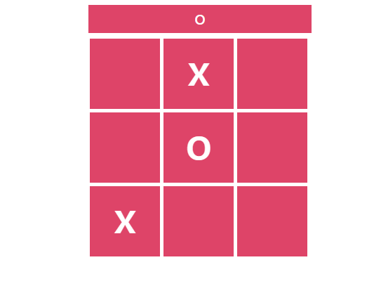

# Portfolio Project: Tic Tac Toe Game

## Introduction
Welcome to my Tic Tac Toe web application! This project was born out of a desire to create a fun and interactive game while honing my skills in web development. As a Full Stack Developer student, I wanted to showcase my ability to build a simple yet engaging game using HTML, CSS, and JavaScript.

  

- **Deployed Site:** [Tic Tac Toe Game](https://sarora2200.github.io/tic-tac-toe/)
- **Final Project Blog Article:** [Tic Tac Toe Web App - Blog Post](#) 
- **Author(s):** Sarah Ahmed ([LinkedIn](https://www.linkedin.com/in/sarah-ahmed-078868151/)) 

## Inspiration and Technical Challenge
The inspiration behind this project came from my passion for classic games and my journey in learning web development. I wanted to challenge myself by implementing the logic of the Tic Tac Toe game using JavaScript algorithms. One of the technical challenges I faced was designing the game's logic to handle player moves, check for a winner, and manage the game's state.

## Next Iteration and Struggles
During the development process, I struggled with optimizing the code for efficiency and readability. In the next iteration, I plan to refactor the codebase to improve performance and implement additional features such as:
- Implementing an AI opponent for single-player mode
- Enhancing the user interface with animations and transitions
- Adding a scoring system and a leaderboard

## Project Timeline
1. **Planning Phase:** Brainstorming game ideas, designing wireframes, and defining project requirements.
2. **Development Phase:** Coding the HTML structure, styling with CSS, and implementing game logic with JavaScript.
3. **Testing Phase:** Testing the game for bugs, usability, and responsiveness across different devices.
4. **Deployment Phase:** Deploying the game to GitHub Pages and sharing it with the community.

## How to Play
1. Open the Tic Tac Toe Game in your web browser.
2. Enjoy the game by taking turns with your opponent to place your symbol (X or O) on the board.

## Contribution and Feedback
Your contributions and feedback are highly appreciated! If you have ideas for improvements or want to contribute to the project, feel free to:
1. Fork the repository
2. Create a new branch
3. Make your changes
4. Open a pull request

Let's make this Tic Tac Toe game even better together! 🚀

Happy Coding  
Created with ❤️ by Sarah Ahmed

